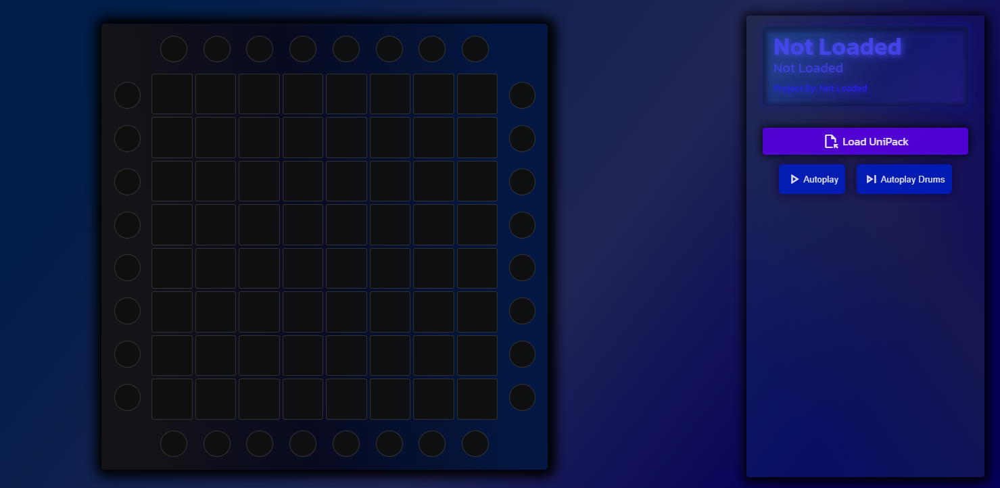

# UnipadJS

UnipadJS is an Unipad Unipack player (thats a mouth full). It can play Unipacks automatically with or without drums. You can also play the Unipack with your mouse and soon physical Launchpad.  
  
Made with HTML5, CSS, and JS. No React or other frameworks.  
  
#### Website Look

#### Lightshow

## What It Can Do
- Read Unipacks
- Autoplay Unipacks
  - with drums aswell
- Simple Launchpad Design
- Can use mouse to play.

## What It Can't Do
- MIDI Launchpad
- Seek autoplay
- Pause autoplay
- Edit Unipacks
- Create Unipacks
- Multi-Launchpad

## Plans
- MIDI Launchpad Support
- Seek/Pause Autoplay
- Record Autoplay
- Record buttons presses (for learning)
- Custom Themes
- Custom Launchpad Skins
- Saving preferences

## Dependencies
- HowlerJS